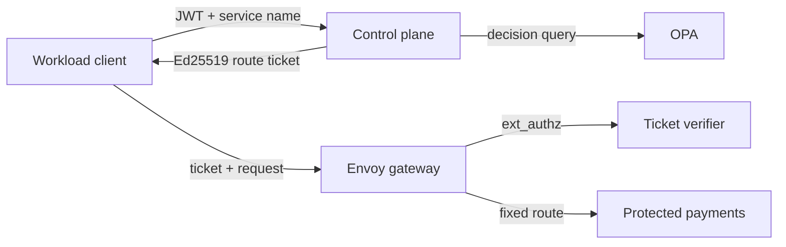
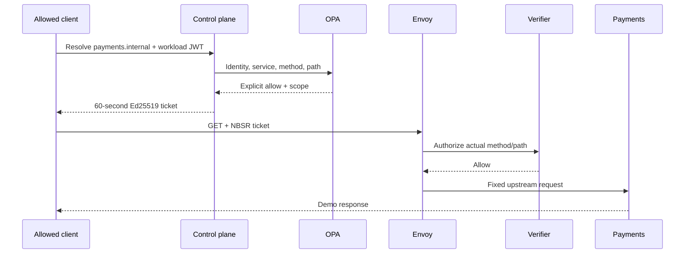
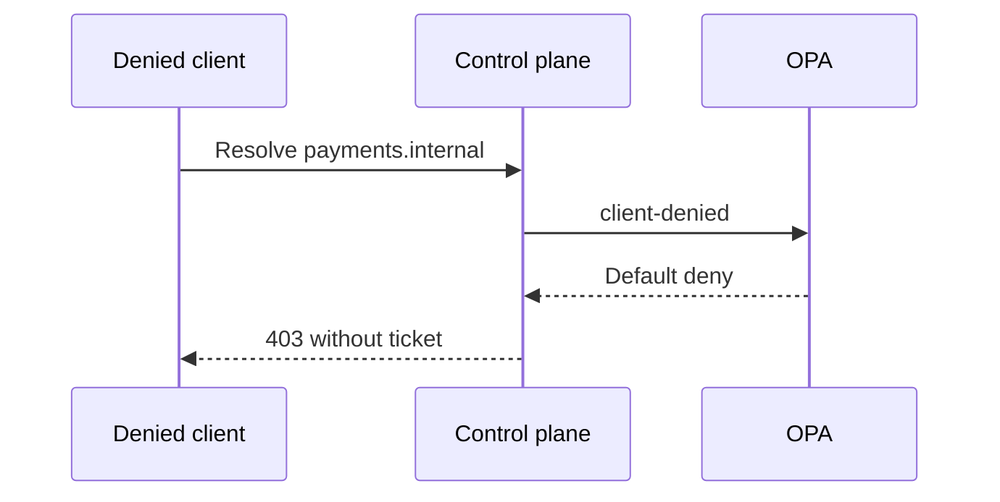
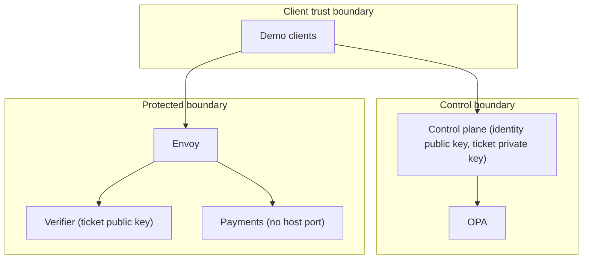

# Name-Based Secure Routing (NBSR)

NBSR turns a logical service name into an authenticated, policy-authorized,
temporary route. It is a local hackathon prototype, not a production system.

DNS answers “where?” but not “may this workload access this service, using this
method and path, right now?” NBSR validates workload identity, asks OPA, issues
a 60-second Ed25519 ticket, and has Envoy enforce that ticket before reaching a
backend that clients cannot address directly.









## Quick start

Prerequisites: Docker Desktop with Compose v2. On Windows:

```powershell
./scripts/bootstrap.ps1
docker compose up -d --build
./scripts/test.ps1
./scripts/demo.ps1
```

On Linux/macOS:

```bash
chmod +x scripts/*.sh
./scripts/bootstrap.sh
docker compose up -d --build
./scripts/test.sh
./scripts/demo.sh
```

Ports 8000 (control plane), 8080 (Envoy), and 8443 (the NBSR name relay) are
published. The payments service and deterministic name origin are on an
internal protected network. The existing enterprise demo prints a scenario
table and exits nonzero on any mandatory mismatch.

## Deterministic name-routing demo

After the Quick start stack is running, exercise the ISP-profile name-routing
vertical slice on Windows:

```powershell
./scripts/name-route-demo.ps1
```

Or on Linux/macOS:

```bash
./scripts/name-route-demo.sh
```

The client requests `facebook.test`, receives only a loopback synthetic
address and a signed 60-second binding, and sends opaque bytes to the published
NBSR gateway. Only the gateway resolves `facebook.test`; the deterministic
origin has no host port and is reachable only through the protected network.
The demo prints the requested name, synthetic address, gateway, opaque origin
response, and a checked assertion that the origin address never appeared in
client-visible route state.

For kind, install Docker, kind, and kubectl, then run `./scripts/kind-up.ps1`
or `./scripts/kind-up.sh`; inspect with `kubectl -n nbsr get
all,networkpolicy`; remove with the matching `kind-down` script. The kind path
is secondary to Compose.

## Tests and troubleshooting

Run `python -m pip install -e ".[dev]"` and `python -m pytest -q` for local unit
tests. Run `opa test policy -v` for policy tests. If startup fails, regenerate
local keys with `scripts/bootstrap`, inspect `docker compose ps`, and then
`docker compose logs <service>`. Tokens expire after eight hours; rerun
bootstrap before a new demo. Do not commit `secrets/` or `tokens/`.

## Security model and limitations

The identity JWT and route ticket use separate Ed25519 keys and explicit EdDSA
allowlists. Issuer, audience, time, SPIFFE-like subject, service, method, path,
and required claims are checked. OPA and the verifier fail closed. Envoy has a
fixed upstream; the public API never returns backend addressing.

Tickets are bearer credentials and this prototype has no replay cache, rate
limiting, HA, key rotation protocol, full SPIFFE/SPIRE, or production PKI. The
optional bootstrap CA is local demonstration material; JWT is the reliable
demo identity path. Production evolution should add SPIFFE/SPIRE or cloud
workload identity, managed rotation, replay controls, hardened mTLS, audit
storage, rate limits, and HA policy/enforcement services.

The ISP-profile relay uses an Ed25519-bound ephemeral client session and a
replay cache; it does not require the enterprise workload JWT, OPA, or client
identity. It forwards HTTP/HTTPS TCP bytes without TLS interception or content
inspection. The loopback Windows adapter proves the protocol boundary but is
not a signed Windows Filtering Platform driver. HTTP/3/QUIC and arbitrary UDP
are excluded from this first release. The gateway operator necessarily sees
requested names and the destinations it resolves, so this prototype does not
claim anonymity from that operator.

## Build Week notes

GPT-5.6 and Codex accelerated implementation, test generation, cross-platform
scripts, and security review. Human-directed decisions remain the trust model,
OPA default-deny policy, Ed25519 key separation, Envoy enforcement boundary,
fixed upstream mapping, and the decision not to claim production readiness.
See [submission draft](docs/build-week-submission.md) and
[three-minute demo](docs/demo-script.md). Before submission, run `/feedback`
and replace the visible session-ID placeholder with the real value.
