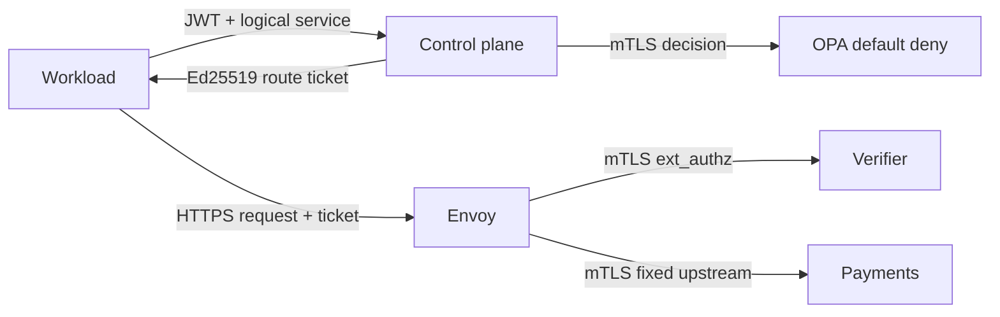

# Name-Based Secure Routing (NBSR)

> **North Star:** NBSR turns a name into a secure route, not an IP address.

This repository is a hardened local protocol vertical slice and enterprise
authorization proof of concept. It is not production-ready and does not claim
full [NBSR Protocol Vision v2](docs/architecture/NBSR_Protocol_Vision_v2.pdf)
conformance.

## What is functional

### ISP-profile registered-name routing

An application requests the explicitly registered name `facebook.test`.
Name control returns a synthetic local address and a short-lived Ed25519-signed
route capability. The capability is bound to the canonical name, stable route
ID, gateway, allowed port, exact resolved endpoint set, policy
version/fingerprint, client session, and expiry.

The TLS 1.3 relay independently enforces its local default-deny registry,
re-resolves immediately before connection, and rejects changed, ambiguous, or
out-of-policy endpoints. The client never receives the durable origin address.
HTTPS remains opaque through the relay, so the client validates the origin
certificate and preserves `facebook.test` as SNI and Host.

Port 80 is a compatibility demonstration inside the authenticated
client-to-relay TLS channel. It sends no NBSR credential to the origin and is
not classified as native end-to-end authenticated NBSR.

### Optional enterprise authorization

The separate enterprise path validates an Ed25519 workload JWT, asks OPA over
TLS 1.3 mTLS, issues a short-lived method/path/service-scoped ticket, and has
Envoy enforce that ticket through an mTLS external-authorizer before a fixed
mTLS backend route.


```mermaid
flowchart LR
    C["Workload"] -->|"JWT + logical service"| CP["Control plane"]
    CP -->|"mTLS decision"| OPA["OPA default deny"]
    CP -->|"Ed25519 route ticket"| C
    C -->|"HTTPS request + ticket"| E["Envoy"]
    E -->|"mTLS ext_authz"| V["Verifier"]
    E -->|"mTLS fixed upstream"| P["Payments"]
```

Enterprise tickets remain short-lived bearer credentials and can be replayed
within their valid lifetime. Channel binding or a distributed one-time replay
store is not implemented.

## Security boundaries

- Arbitrary public hostnames, public IPs, destination overrides, private/special
  addresses, Unicode ambiguity, stale policy, and DNS rebinding fail closed.
- Public global-unicast status is never route authorization.
- The ISP relay is not connected to the enterprise protected network.
- Payments, verifier, OPA, and the demo origin have no host publications.
- Developer ingress ports bind explicitly to `127.0.0.1`.
- Every sensitive cross-container enterprise hop uses verified TLS 1.3 mTLS.
- Generated secrets, tokens, and certificates are ignored and excluded from
  Docker and release archives.

See [architecture](docs/architecture.md),
[security model](docs/security-model.md), [threat model](docs/threat-model.md),
and the [hardening report](docs/security-hardening-report.md).

## Requirements

- Docker Desktop with the Linux engine and Compose v2
- Python `>=3.12,<3.14` for local development
- OPA CLI for direct Rego tests
- Kind v0.32+ and kubectl for the Kubernetes reference deployment

The primary container runtime is digest-pinned Python 3.13.14. Exact runtime and
development constraints are in `constraints/`.

## Docker Compose demo

Windows PowerShell:

```powershell
./scripts/demo.ps1
```

Linux/macOS:

```bash
./scripts/demo.sh
```

The wrapper regenerates ignored local credentials, performs a fresh Compose
build/deployment, and runs eight mandatory enterprise allow/deny scenarios.
Expected denials cover unauthorized identity, unknown service, missing ticket,
tampering, method/path escalation, direct backend access, and expiry.

With the stack running, execute the registered-name demonstration:

```powershell
./scripts/name-route-demo.ps1
```

or:

```bash
./scripts/name-route-demo.sh
```

Published developer endpoints are loopback-only:

| Port | Endpoint |
|---|---|
| 8000 | Enterprise TLS control plane |
| 8080 | Enterprise TLS Envoy gateway |
| 8443 | ISP TLS name relay |
| 8444 | ISP TLS name control |

Clean up:

```powershell
docker compose down -v --remove-orphans
```

## Kind reference deployment

The Kind workflow disables Kind's default CNI and installs Calico v3.32.1 from
a pinned URL only after verifying its SHA-256. It then deploys namespace-wide
default-deny policy and runs positive/negative Service IP, Pod IP,
cross-namespace, metadata, and link-local probes.

```powershell
./scripts/kind-up.ps1
```

or:

```bash
./scripts/kind-up.sh
```

Remove all local cluster resources:

```powershell
./scripts/kind-down.ps1
```

## Tests

Install the exact development set:

```bash
python -m pip install --constraint constraints/dev.txt -e ".[dev]"
```

Run:

```bash
python -m pytest -q
python -m ruff check .
python -m ruff format --check .
opa test policy -v
docker compose config --quiet
```

Python 3.12.13 and 3.13.14 are tested. Python 3.14 is intentionally outside the
declared range.

## Deterministic release archive

Both wrappers require an explicit Git ref and reject tracked dirty source:

```powershell
./scripts/package-release.ps1 HEAD
```

```bash
./scripts/package-release.sh HEAD
```

Packaging uses a Git-derived source set, rejects prohibited/secret-like
content, writes a deterministic inventory and ZIP under ignored `dist/`,
re-extracts and compares the archive, runs pytest plus Ruff from the extracted
copy in digest-pinned Python 3.13.14, and writes a SHA-256 sidecar.

## Explicit limitations

Not implemented: native signed name ownership/delegation, a normative
multiplexed tunnel profile, active lease renewal, key rotation, revocation
distribution, migration/resumption, regional HA, real ISP federation,
subscriber billing, QUIC/HTTP3, arbitrary UDP, mobile wake-up integration,
production PKI/HSM, durable distributed replay state, a signed Windows
Filtering Platform driver, or independent interoperable implementations.

The current Windows adapter behavior is unit/in-process tested. It is not a
validated full-device Windows networking deployment.
