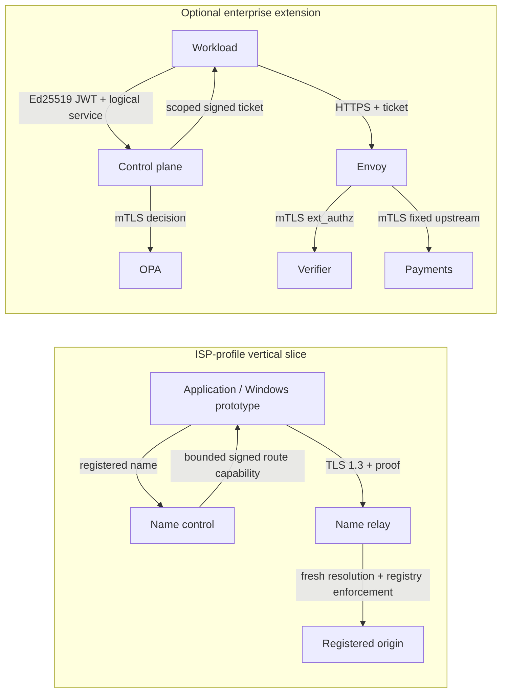

# NBSR architecture

The project direction is governed by
[NBSR Protocol Vision V3.6](architecture/NBSR_Protocol_Vision_V3.6.md):
every successful resolution through an upgraded NBSR network returns a scoped
Synthetic IP, and connecting to it creates or reuses a secure route while the
origin remains internal. This repository is a bounded prototype plus frozen
Core v0.1 data work. It is not the complete native protocol and is not
production-ready. Vision V3 and Vision V2 remain historical design evidence.

Forward-looking architecture is split into:

- [Transport Session and Service Channel architecture](architecture/session-channel-model.md);
- [Origin publication and migration](architecture/origin-publication-migration.md);
- [V3.6 state-machine proposals](architecture/protocol-state-machine.md); and
- [V3.6 decisions and compatibility impact](protocol/v3.6-decisions.md).

## Implemented profiles

The ISP profile does not require enterprise IAM, subscriber billing, content
inspection, or workload authorization. The enterprise profile adds identity,
OPA, method/path scope, and Envoy enforcement without redefining the core
name-first goal.

## Default-deny name-routing boundary

`config/name-routes.json` is the operator-controlled registry used by the
prototype. A route entry contains:

- canonical NBSR name and stable route ID;
- configured origin hostname;
- permitted TCP ports;
- allowed endpoint CIDRs or exact address constraints;
- expected application Host and TLS SNI;
- enabled state; and
- policy version plus deterministic fingerprint.

The public request accepts only the registered name and transport capability.
It rejects arbitrary destinations, IP literals, destination overrides,
non-canonical aliases, and Unicode ambiguity. Global-unicast status is never an
authorization rule.

The name control resolves the configured origin and signs the exact admitted
endpoint set. The relay does not trust that signature alone: it independently
loads local policy, checks route ID/version/fingerprint, re-resolves immediately
before connection, and requires the fresh endpoint set to match both the signed
authorization and current registry constraints.

## Docker Compose trust topology

Compose uses five explicit networks:

| Network | Members | Purpose |
|---|---|---|
| `enterprise-client-network` | clients, control plane, gateway | Developer ingress to enterprise APIs. |
| `enterprise-control-network` | control plane, OPA | Internal mTLS policy decision path. |
| `enterprise-protected-network` | gateway, ticket verifier, payments | Fixed mTLS authorization and backend path. |
| `isp-client-network` | name control, name relay | ISP-profile client/control ingress. |
| `isp-origin-network` | name relay, name origin | Relay-only origin path. |

The relay has no interface on the enterprise protected network. Payments,
ticket verifier, OPA, and the deterministic origin publish no host ports. The
only developer publications are TLS endpoints on `127.0.0.1`: 8000, 8080,
8443, and 8444.

Each cross-container identity, authorization, route-ticket, protected metadata,
or application payload hop uses verified TLS. Control plane to OPA, Envoy to
verifier, and Envoy to payments require TLS 1.3 mTLS with service-specific
certificates, SANs, EKUs, and client identities. Client-facing control, gateway,
name-control, and relay paths use server-authenticated TLS with separate
enterprise and ISP demo trust domains.

## Kubernetes reference deployment

Kind is a deployment reference, not a protocol dependency. The cluster disables
Kind's default CNI and installs checksum-verified Calico v3.32.1. Namespace-wide
ingress and egress start default-deny. Workload policies permit only:

- control plane to OPA;
- gateway to ticket verifier and payments;
- relay to the registered origin on ports 80 and 443; and
- DNS from only the workloads that need it to pods labeled
  `k8s-app: kube-dns` in `kube-system`.

The verification harness proves both positive and negative paths, including
Service IP, Pod IP, unrelated pod, cross-namespace, metadata, and link-local
denials. Accepting the YAML is not treated as enforcement evidence.

## Address concealment

The application asks for a registered name and receives a synthetic local
address plus a short-lived route capability. It does not receive the durable
origin address. The relay operator necessarily observes the requested name and
the destination it resolves; the prototype therefore claims backend
concealment from the client, not anonymity from the operator.

HTTPS is the preferred security demonstration. The relay copies opaque bytes,
the client validates the origin certificate, and the origin observes the
registered name as SNI and Host. Port 80 remains a documented compatibility
mode inside the authenticated client-to-relay channel and is not classified as
native end-to-end authenticated NBSR.

## Explicitly unimplemented architecture

The following V3.6 architecture remains design-only or absent: a universal
synthetic Name Node, OriginSet discovery/publication, certified QUIC Transport
Sessions, reusable multi-service Service Channels, independent channel
cryptographic contexts, lease renewal, key rotation, distributed revocation,
live migration/resumption/handover, regional HA, ISP source/destination
federation, cross-operator trust, arbitrary UDP, and independent interoperable
implementations.
