# NBSR Protocol Vision V3.6

**Status:** Current architectural source of truth for forward-looking protocol
work

**Adopted:** 2026-07-28

**Source:** `NBSR_Protocol_Vision_V3.6_Source_Draft.docx`, supplied for this
review and reconciled with the approved Core v0.1 decisions D1-D6

**Source SHA-256:** `6f0e7671a32b60afd5e2290c7d4c6d2615b7e7634fdf47ac9c02a4c849a15049`

**Scope:** Architecture, invariants, compatibility boundaries, work-package
direction, and human decision gates. This document does not allocate wire
values or authorize runtime implementation.

## Precedence and preservation

V3.6 supersedes conflicting forward-looking architecture in the retained
[Vision V3 document](NBSR_Protocol_Vision_V3_and_Codex_Build_Directive.md).
Vision V3, Vision V2, the feasibility research, prototype ADRs, Build Week
evidence, and dated plans remain historical evidence. They are not deleted or
rewritten as if they had tested V3.6.

The precedence order for new protocol work is:

1. approved Core v0.1 decisions D1-D6 for frozen wire schemas, registries,
   deterministic CBOR, COSE wrappers, `kid` bindings, revocation behavior, and
   state registries;
2. this V3.6 architecture for forward-looking behavior and invariants;
3. approved V3.6 extension or Core v0.2 decisions, once they exist;
4. retained Vision V3 and Vision V2 material where it does not conflict; and
5. prototype evidence only for behavior actually demonstrated.

V3.6 does not silently alter Core v0.1. When its architecture needs a new key,
message code, state, transition, critical extension, wrapper, or signing
authority, implementation stops at the corresponding human approval gate in
[the V3.6 decision record](../protocol/v3.6-decisions.md).

## North Star

NBSR upgrades the naming layer into a secure-routing protocol. Every successful
name resolution returns a scoped synthetic IP. The client connects normally to
that synthetic IP; NBSR then creates or reuses authenticated encrypted
edge-to-edge transport while keeping mutable origin reachability internal.

The required rule is:

> Session reuse, service isolation.

## Resolver-first contract

For every successfully resolved name:

- the NBSR Name Node returns a scoped synthetic IP;
- the origin IP is never returned to the client;
- the synthetic mapping is bound to resolution and source-edge context;
- a connection to the synthetic IP triggers secure route establishment;
- origin endpoints remain internal routing metadata; and
- direct client fallback to an origin endpoint is forbidden.

For an NBSR-aware service, signed NBSR identity and policy authorize the route.
For a legacy service, conventional DNS may be used internally as a constrained
reachability adapter. Legacy DNS does not authorize a route, its TTL is not a
route lease, and its A/AAAA result never becomes a client-visible fallback.

Networks that are not upgraded may continue to use conventional DNS. Once a
network presents itself as an NBSR resolver/source-edge system, it must enforce
the universal synthetic response contract for successful address resolution.

## Identity and reachability separation

Service identity is never derived from an IP address. These concepts are
distinct:

- **Service Identity:** stable authorized identity bound to a Service Name,
  service identifier, owner/issuer authority, policy, generation, and
  revocation state.
- **Synthetic IP:** scoped client-facing compatibility handle.
- **Origin Endpoint:** mutable internal address, discovery hostname,
  connector, or controlled egress target.
- **Source Edge:** edge that owns the synthetic traffic path and performs
  source-side correlation and admission.
- **Destination Edge:** independently admitting edge that can reach an
  authorized connector or origin.
- **Connector/service target:** controlled final reachability mechanism, not
  proof of service identity.

The protocol invariants are:

`Service Identity != Origin Endpoint`

`Synthetic IP != Origin Endpoint`

Changing an Origin Endpoint may change the final route segment for new work.
It must not change Service Identity, create authorization, or force the client
to learn a new origin address.

## End-to-end architecture flow

1. Application requests a name through its ordinary resolver interface.
2. The local NBSR Name Node receives and canonicalizes the request.
3. NBSR identity/policy or constrained legacy reachability metadata is
   discovered internally.
4. Service Identity and applicable policy are validated.
5. The Name Node allocates or retrieves a stable scoped synthetic mapping.
6. Name Node returns the synthetic IP; origin metadata is withheld.
7. The application connects to the synthetic IP with an ordinary socket.
8. The Source Edge maps that connection to its RouteIntent and resolution
   context.
9. A compatible Transport Session is reused or created.
10. A Route Context / Service Channel is independently authorized for the
    requested service.
11. An Application Stream is opened inside that Service Channel.
12. The Source Edge routes to an independently admitting Destination Edge.
13. The Destination Edge selects a validated Origin Endpoint or connector.
14. The origin remains hidden from the client throughout success and failure.

```mermaid
flowchart LR
    A["Application requests a name"] --> N["NBSR Name Node"]
    N --> M["Validate identity, policy, and internal reachability"]
    M --> S["Return scoped synthetic IP"]
    S --> C["Application connects to synthetic IP"]
    C --> E1["Source Edge maps RouteIntent"]
    E1 --> T["Reuse or create Transport Session"]
    T --> CH["Independently authorize Service Channel"]
    CH --> ST["Open Application Stream"]
    ST --> E2["Destination Edge admission"]
    E2 --> O["Validated Origin Endpoint / Connector"]
```

## Transport hierarchy

The conceptual hierarchy is:

`Transport Session -> Route Context / Service Channel -> Application Stream`

- A **Transport Session** is an authenticated, encrypted edge-to-edge
  relationship, expected to use QUIC/TLS 1.3 in the planned profile.
- A **Route Context** carries bounded route authorization and lifecycle state
  for one service.
- A **Service Channel** is the service-bound logical security context that
  enforces that Route Context inside a reusable Transport Session.
- An **Application Stream** is one proxied application flow, initially one TCP
  connection.

One compatible Transport Session may carry channels for multiple services, but
authorization never crosses a channel boundary. The complete model is defined
in [Session and Service Channel Architecture](session-channel-model.md).

## Origin publication direction

Origin reachability migrates through:

`LEGACY_DNS -> HYBRID -> NBSR_NATIVE`

The client-visible contract never changes. Origin source precedence is:

1. a valid, current, authorized signed NBSR-native OriginSet;
2. valid delegated Destination Edge or connector metadata;
3. constrained legacy DNS discovery; or
4. fail closed.

The OriginSet lifecycle, safe replacement, caching, rollback protection, and
drain behavior are defined in
[Origin Publication and Migration](origin-publication-migration.md).

## Mobility and continuity

A network-path or client source-IP change alone does not change Service
Identity or application authorization.

- Same-edge QUIC connection migration may preserve a Transport Session only
  after path validation and profile checks.
- Transport resumption may restore only unexpired, unrevoked, replay-safe
  state that still matches the gateway, client/device, service, and policy
  bindings.
- Source-edge or Destination Edge failover may select another authorized peer,
  but no grant or Route Context transfers blindly.
- Gateway handover requires explicit authority and proof. It is not implied by
  reachability.

Any resumed or migrated state remains subject to expiry, revocation, replay
protection, gateway binding, client/device binding, service binding, and
policy version or digest checks. Exact messages and handover authority remain
pending human decisions.

## Application-protocol boundary

NBSR owns:

- name-resolution compatibility and synthetic mapping;
- Service Identity and secure-route establishment;
- Transport Session establishment;
- Service Channel authorization and route revocation;
- edge failover and supported session continuity;
- origin discovery and update handling; and
- routing auditability.

Application protocols retain:

- user login and application authorization;
- cookies, OAuth state, and request/response semantics;
- transactions and application data meaning;
- application-specific consistency; and
- application-specific recovery.

NBSR does not replace HTTP, OAuth, end-to-end TLS at the application endpoint,
database semantics, or all application retry logic.

## Core v0.1 boundary

Core v0.1 already freezes:

- 17 message codes and 19 error codes;
- explicit numeric fields for six D6 objects;
- deterministic RFC 8949 CBOR rules;
- COSE Sign1 object wrappers and `kid` bindings;
- revocation lifetime, target-sequence, and tombstone behavior; and
- Resolution, Tunnel, Stream, and Connector state registries/transitions.

Those decisions remain unchanged. V3.6 architecture is not permission to add
OriginSet to ServiceRecord, reinterpret D6 `publication_mode` wire values,
allocate origin-update or handover messages, or create new frozen states.

## Scope classification

| V3.6 material | Current classification |
|---|---|
| Universal synthetic resolution, origin hiding, identity separation, application boundary | Editorial clarification with no wire impact |
| Transport/Service Channel hierarchy and OriginSet logical planning | Internal implementation model with no wire impact until serialized |
| Optional extension carriage using existing Core extension rules | Backward-compatible extension only after explicit approval |
| OriginSet wire object, native updates, channel wire representation, resume/handover messages | Core v0.2 candidate |
| Any change to D1-D6 mappings, codes, wrappers, or accepted values | Incompatible change requiring explicit human approval |

## Implementation guard

No runtime work follows solely from this document. The phase plan and its
human gates are in
[the V3.6 protocol roadmap](../superpowers/plans/2026-07-28-v3.6-protocol-roadmap.md).
The [anti-drift checklist](../protocol/v3.6-anti-drift-checklist.md) applies to
every future design, implementation, review, and conformance change.
