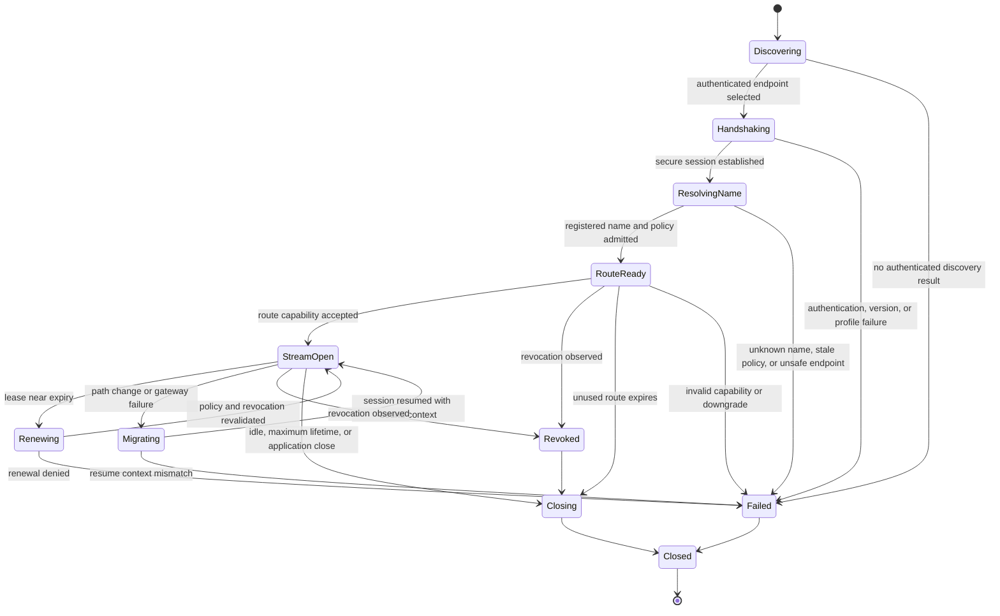

# NBSR protocol state machine draft

This is a design-level state machine aligned with
[NBSR Protocol Vision v2](NBSR_Protocol_Vision_v2.pdf). It is not a normative
wire specification. The repository implements only the Phase 1 vertical slice
identified below. Renewal, revocation distribution, migration, resumption,
multiplexing, and federation are deliberately not implemented in this run.

## 1. Discovery

**Target behavior:** Locate a suitable NBSR edge through signed configuration,
ISP discovery, anycast, a compatibility bootstrap record, or another reviewed
mechanism. Discovery output must identify the expected peer and supported
mandatory security profile.

**Prototype:** Gateway endpoints are configured. The Windows prototype tries
them in order and requires a configured trust anchor. Regional discovery,
signed discovery, and source/destination operator federation are design-only.

**Failure rule:** An empty result, unauthenticated redirect, unsupported
mandatory profile, or downgrade attempt ends the attempt. There is no plaintext fallback.

## 2. Secure handshake

**Target behavior:** Authenticate the relevant peers, negotiate a certified
transport profile, derive forward-secret keys, bind the session to the requested
name context, and establish anti-replay state.

**Prototype:** Client-facing control and relay paths use verified TLS; the
client-to-relay path requires TLS 1.3. Internal enterprise hops use TLS 1.3 mTLS.
The ISP admission proof binds an ephemeral Ed25519 session key. This is not yet
a native multiplexed NBSR tunnel or conformance profile.

**Failure rule:** Missing trust anchor, invalid chain, SAN/EKU mismatch, expiry,
missing client certificate where required, negotiation failure, or plaintext
endpoint is terminal for that endpoint.

## 3. Registered-name resolution

**Target behavior:** Resolve an NBSR name through native signed ownership and
delegation.

**Prototype:** An operator-controlled default-deny registry maps
`facebook.test` to a stable route ID, configured origin hostname, allowed ports,
endpoint constraints, expected SNI/Host, enabled state, and policy fingerprint.
The caller cannot supply an origin or IP override. Gateway-side DNS is still
used for the configured demo origin, so native naming is partial.

**Failure rule:** Unknown, disabled, non-canonical, Unicode-ambiguous, stale, or
policy-mismatched names fail closed.

## 4. Route creation

**Target behavior:** Produce a name-bound, policy-governed route without giving
the application a durable backend IP.

**Prototype:** The name control signs the canonical name, route ID, port,
authorized endpoint set, policy version/fingerprint, gateway, audience, issuer,
client session thumbprint, and expiry. The relay independently loads the same
registry, re-resolves immediately before connection, and requires exact
agreement between signed and local policy. Enterprise route creation instead
uses workload identity, OPA, and a scoped bearer ticket.

**Failure rule:** Empty or changed resolution, endpoint ambiguity, out-of-policy
CIDR, wrong port/route/gateway, expired capability, or replayed ISP admission is
rejected.

## 5. Stream establishment

**Target behavior:** Open one or more application streams over the secure route
while preserving end-to-end service authentication where possible.

**Prototype:** One TCP flow is relayed per connection. HTTPS remains opaque and
preserves the configured name as SNI and Host. Compatibility HTTP is carried
inside the outer TLS channel and sends no NBSR credential to the origin.
Multiplexing is not implemented.

**Failure rule:** No application byte is forwarded before relay admission
succeeds. An origin connection failure does not trigger an unregistered
destination or plaintext retry.

## 6. Lease renewal

**Target behavior:** Before expiry, revalidate policy, quotas, revocation, and
session state; rotate keys when required; extend the lease without interrupting
authorized active streams.

**Prototype:** Design/documentation only. The client can request a fresh
short-lived binding before a new admission, but there is no in-stream renewal or
key rotation protocol.

## 7. Revocation

**Target behavior:** Distribute issuer, client, route, name, or policy
revocations with defined latency. Stop new streams and apply a specified
termination or completion-grace rule to active streams.

**Prototype:** Design/documentation only. Local policy disablement and
fingerprint changes invalidate new ISP admissions, but there is no distributed
revocation channel.

## 8. Migration and resumption

**Target behavior:** Resume after path or gateway change while remaining bound
to the same name, client, authorization, lease, anti-replay state, and security
profile.

**Prototype:** Ordered pre-admission gateway failover is unit-tested. Live path
migration, session resumption, mobile network transition, and application
transfer resume are not implemented.

## 9. Closure

**Target behavior:** Close on application request, idle timeout, maximum
lifetime, revocation, fatal policy change, or unrecoverable transport failure;
erase ephemeral secrets and release route state.

**Prototype:** Connection close, handshake deadlines, route expiry, bounded
replay cleanup, and synthetic-address recovery exist. General idle and maximum
tunnel lifetime semantics are design-only.

## 10. Failure and downgrade behavior

- Security is mandatory for native NBSR. No insecure mode or certificate
  verification disable switch is defined.
- A TLS failure is not retried over HTTP.
- An unsupported protocol version or missing mandatory property is a terminal
  negotiation failure.
- DNS bootstrap or compatibility behavior cannot authorize an unregistered
  destination.
- Cache exhaustion, ambiguous resolution, invalid replay state, and partial
  policy availability fail closed.
- Compatibility HTTP is labeled as coexistence mode, never as native
  end-to-end authenticated NBSR.
