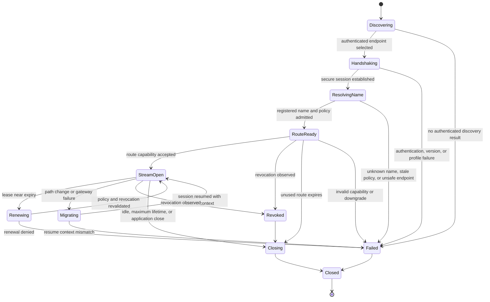

# NBSR protocol state machines

The current direction is
[NBSR Protocol Vision V3.6](NBSR_Protocol_Vision_V3.6.md). The frozen Core v0.1
state registries remain unchanged: Resolution, Tunnel, Stream, and Connector
states/transitions are defined by D3/Task 2 and protected by executable tests.

The original diagram and prototype commentary below are retained as historical
design evidence. The V3.6 lifecycle diagrams later in this document are a
**documentation-only proposal**. They do not allocate new states, transitions,
message codes, or wire fields. Any normative registry change requires human
approval and version/extension classification.

## 1. Discovery

**Target behavior:** Locate a suitable NBSR edge through signed configuration,
ISP discovery, anycast, a compatibility bootstrap record, or another reviewed
mechanism. Discovery output must identify the expected peer and supported
mandatory security profile.

**Prototype:** Gateway endpoints are configured. The Windows prototype tries
them in order and requires a configured trust anchor. Regional discovery,
signed discovery, and source/destination operator federation are design-only.

**Failure rule:** An empty result, unauthenticated redirect, unsupported
mandatory profile, or downgrade attempt ends the attempt. There is no plaintext fallback.

## 2. Secure handshake

**Target behavior:** Authenticate the relevant peers, negotiate a certified
transport profile, derive forward-secret keys, bind the session to the requested
name context, and establish anti-replay state.

**Prototype:** Client-facing control and relay paths use verified TLS; the
client-to-relay path requires TLS 1.3. Internal enterprise hops use TLS 1.3 mTLS.
The ISP admission proof binds an ephemeral Ed25519 session key. This is not yet
a native multiplexed NBSR tunnel or conformance profile.

**Failure rule:** Missing trust anchor, invalid chain, SAN/EKU mismatch, expiry,
missing client certificate where required, negotiation failure, or plaintext
endpoint is terminal for that endpoint.

## 3. Registered-name resolution

**Target behavior:** Resolve an NBSR name through native signed ownership and
delegation.

**Prototype:** An operator-controlled default-deny registry maps
`facebook.test` to a stable route ID, configured origin hostname, allowed ports,
endpoint constraints, expected SNI/Host, enabled state, and policy fingerprint.
The caller cannot supply an origin or IP override. Gateway-side DNS is still
used for the configured demo origin, so native naming is partial.

**Failure rule:** Unknown, disabled, non-canonical, Unicode-ambiguous, stale, or
policy-mismatched names fail closed.

## 4. Route creation

**Target behavior:** Produce a name-bound, policy-governed route without giving
the application a durable backend IP.

**Prototype:** The name control signs the canonical name, route ID, port,
authorized endpoint set, policy version/fingerprint, gateway, audience, issuer,
client session thumbprint, and expiry. The relay independently loads the same
registry, re-resolves immediately before connection, and requires exact
agreement between signed and local policy. Enterprise route creation instead
uses workload identity, OPA, and a scoped bearer ticket.

**Failure rule:** Empty or changed resolution, endpoint ambiguity, out-of-policy
CIDR, wrong port/route/gateway, expired capability, or replayed ISP admission is
rejected.

## 5. Stream establishment

**Target behavior:** Open one or more application streams over the secure route
while preserving end-to-end service authentication where possible.

**Prototype:** One TCP flow is relayed per connection. HTTPS remains opaque and
preserves the configured name as SNI and Host. Compatibility HTTP is carried
inside the outer TLS channel and sends no NBSR credential to the origin.
Multiplexing is not implemented.

**Failure rule:** No application byte is forwarded before relay admission
succeeds. An origin connection failure does not trigger an unregistered
destination or plaintext retry.

## 6. Lease renewal

**Target behavior:** Before expiry, revalidate policy, quotas, revocation, and
session state; rotate keys when required; extend the lease without interrupting
authorized active streams.

**Prototype:** Design/documentation only. The client can request a fresh
short-lived binding before a new admission, but there is no in-stream renewal or
key rotation protocol.

## 7. Revocation

**Target behavior:** Distribute issuer, client, route, name, or policy
revocations with defined latency. Stop new streams and apply a specified
termination or completion-grace rule to active streams.

**Prototype:** Design/documentation only. Local policy disablement and
fingerprint changes invalidate new ISP admissions, but there is no distributed
revocation channel.

## 8. Migration and resumption

**Target behavior:** Resume after path or gateway change while remaining bound
to the same name, client, authorization, lease, anti-replay state, and security
profile.

**Prototype:** Ordered pre-admission gateway failover is unit-tested. Live path
migration, session resumption, mobile network transition, and application
transfer resume are not implemented.

## 9. Closure

**Target behavior:** Close on application request, idle timeout, maximum
lifetime, revocation, fatal policy change, or unrecoverable transport failure;
erase ephemeral secrets and release route state.

**Prototype:** Connection close, handshake deadlines, route expiry, bounded
replay cleanup, and synthetic-address recovery exist. General idle and maximum
tunnel lifetime semantics are design-only.

## 10. Failure and downgrade behavior

- Security is mandatory for native NBSR. No insecure mode or certificate
  verification disable switch is defined.
- A TLS failure is not retried over HTTP.
- An unsupported protocol version or missing mandatory property is a terminal
  negotiation failure.
- DNS bootstrap or compatibility behavior cannot authorize an unregistered
  destination.
- Cache exhaustion, ambiguous resolution, invalid replay state, and partial
  policy availability fail closed.
- Compatibility HTTP is labeled as coexistence mode, never as native
  end-to-end authenticated NBSR.

## V3.6 proposed lifecycle decomposition

These lifecycles describe required behavior independently so shared transport
does not collapse service authorization or origin reachability into one
machine.

### Transport Session lifecycle

Conceptual flow:

`IDLE -> DISCOVERING -> HANDSHAKING -> AUTHENTICATING -> ACTIVE`

`ACTIVE -> RENEWING -> ACTIVE`

`ACTIVE -> DRAINING -> CLOSED`

`ACTIVE -> MIGRATING -> ACTIVE`

`ACTIVE -> FAILED -> RESUMING -> ACTIVE`

These names already exist in the frozen Tunnel registry where applicable.
V3.6 clarifies that the machine represents edge-to-edge transport, not
universal service authorization. Session failure interrupts carried channels;
session recovery does not authorize or revive any channel.

### Service Channel lifecycle

Conceptual documentation-only proposal:

`NEW -> ADMISSION_PENDING -> ACTIVE -> DRAINING -> CLOSED`

`NEW|ADMISSION_PENDING -> REJECTED`

`ADMISSION_PENDING|ACTIVE|DRAINING -> REVOKED`

Entry to `ACTIVE` requires service-specific admission and independent
cryptographic/transcript binding. A rejected or revoked channel does not
unnecessarily terminate another channel on the same Transport Session.
Neither a Service Channel registry nor these transitions are frozen in Core
v0.1; human approval is required.

### Origin publication lifecycle

Conceptual documentation-only proposal:

`CANDIDATE -> AUTHENTICATING -> VALIDATING -> HEALTH_CHECKING -> ACTIVE`

`ACTIVE -> SUPERSEDED -> DRAINING -> RETIRED`

`CANDIDATE|AUTHENTICATING|VALIDATING|HEALTH_CHECKING -> REJECTED`

Generation, sequence, validity, issuer, revocation, content digest, and rollback
checks occur before activation. A same-sequence different-content candidate is
rejected and recorded as equivocation. No OriginSet state registry is frozen;
human approval is required before a native wire state exists.

### Migration and resumption lifecycle

Conceptual flow:

`ACTIVE -> PATH_VALIDATING -> MIGRATED`

or, after transport loss:

`FAILED -> RESUME_PROOF_PENDING -> REAUTHORIZING -> RESUMED`

Same-edge QUIC migration may preserve the Transport Session after path
validation. Cross-edge recovery requires approved handover or fresh
authorization. Every surviving Route Context / Service Channel remains
expiry-, revocation-, replay-, gateway-, client/device-, service-, and
policy-bound. The additional conceptual labels are not frozen states.

### Graceful origin drain lifecycle

Conceptual documentation-only proposal:

`ACTIVE_OLD -> REPLACEMENT_VALIDATING -> DRAINING_OLD -> RETIRED_OLD`

New channels use the validated replacement. Existing permitted Application
Streams may finish within an approved bound unless explicit invalidation or
revocation requires immediate termination. Blind delete-and-replace is
forbidden. Drain maximum and native update signaling require human approval.

## Failure containment across machines

- Origin publication failure cannot reveal an Origin Endpoint or downgrade the
  client to direct IP connectivity.
- Service Channel failure cannot authorize or unnecessarily terminate another
  service.
- Transport Session migration/resumption cannot revive an expired or revoked
  channel.
- Destination Edge failover cannot bypass issuer, grant, service, policy, or
  OriginSet validation.
- Health-check state cannot create Service Identity or authorization.

## Registry protection

The V3.6 proposal deliberately reuses prose labels without adding them to
`nbsr.protocol.states`. Before any label becomes normative, a decision must
classify it as an editorial mapping, internal-only implementation state,
backward-compatible extension, Core v0.2 state, or incompatible Core v0.1
change. Tests must then freeze the approved exact names and transitions.
